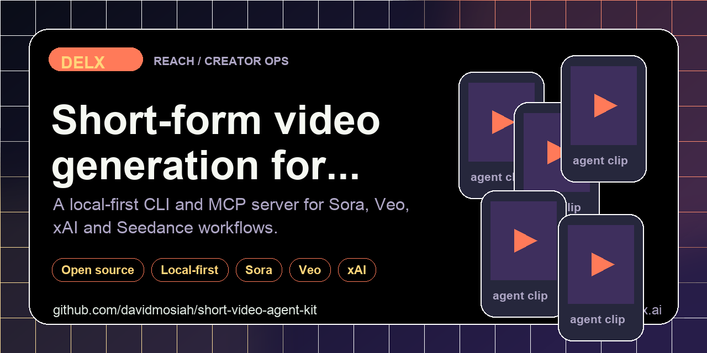

<!-- delx header v2 -->
<h1 align="center">Short Video Agent Kit</h1>

<div align="center">
  
</div>

<h3 align="center">
  One agent-first CLI + MCP for short-form AI video.<br>Sora · Veo · xAI · Seedance &mdash; dry-run by default, paid generation when explicitly enabled.
</h3>

<p align="center">
  <a href="https://www.npmjs.com/package/short-video-agent-kit"></a>
  <a href="https://www.npmjs.com/package/short-video-agent-kit"></a>
  <a href="LICENSE"></a>
  <a href="https://modelcontextprotocol.io"></a>
</p>

<p align="center">
  <a href="https://github.com/davidmosiah/short-video-agent-kit/stargazers"></a>
  <a href="https://github.com/davidmosiah/short-video-agent-kit/actions/workflows/ci.yml"></a>
  <a href="https://github.com/davidmosiah"></a>
  <a href="https://github.com/davidmosiah/short-video-agent-kit"></a>
</p>

> ⭐ **If this agent-first tool helps your workflow, please star the repo.** Stars make this tooling easier for other builders to discover and help Delx keep shipping open infrastructure.<br>
> 🧱 Part of the [Delx agent stack](https://github.com/davidmosiah) &mdash; 15 open-source MCP servers across **body, reach and coordination**.

---

<!-- /delx header v2 -->

Provider-neutral short-form AI video toolkit for agents. It gives Codex, Claude, Cursor, Hermes, OpenClaw and other MCP clients one interface for building dry-run payloads and, when explicitly enabled, generating vertical video through Sora/OpenAI, Gemini Veo, xAI/Grok and Seedance/PiAPI-style providers.

Use it when an agent needs one safe interface for prompt-to-video payload validation and optional paid generation across multiple providers.

## Why It Is Agent-First

Video generation can be expensive and prompt-sensitive. This package makes agents start with safe steps:

- inspect provider readiness
- return privacy boundaries
- build payloads without spending credits
- require `--live` or `SHORT_VIDEO_DRY_RUN=false` before provider calls
- keep prompts and outputs in local user-controlled paths

## Install

```bash
npm install -g short-video-agent-kit
```

Or run directly:

```bash
npm exec --yes --package=short-video-agent-kit -- short-video-agent-kit doctor
```

## CLI

```bash
short-video-agent-kit manifest --client codex
short-video-agent-kit doctor
short-video-agent-kit privacy-audit
short-video-agent-kit payload --provider gemini_veo --prompt-file prompt.txt
short-video-agent-kit generate --provider openai_sora --prompt "Vertical product teaser" --output ./output/teaser.mp4
short-video-agent-kit generate --provider openai_sora --prompt-file prompt.txt --output ./output/teaser.mp4 --live
```

Supported providers:

- `openai_sora`
- `gemini_veo`
- `xai_grok`
- `seedance_piapi`

## MCP

```bash
short-video-mcp
```

HTTP transport:

```bash
SHORT_VIDEO_MCP_TRANSPORT=http short-video-mcp
```

Hermes-style config:

```yaml
mcp_servers:
  short_video:
    command: npx
    args: ["-y", "short-video-agent-kit"]
    sampling:
      enabled: false
```

Recommended first calls:

1. `short_video_connection_status`
2. `short_video_privacy_audit`
3. `short_video_build_payload`
4. `short_video_generate`

## Agent Surfaces

| Tool | Purpose |
|---|---|
| `short_video_agent_manifest` | Install/runtime guidance for Codex, Claude, Cursor, Hermes and OpenClaw |
| `short_video_connection_status` | Provider readiness without API keys |
| `short_video_privacy_audit` | Prompt, output and reference-asset boundaries |
| `short_video_build_payload` | Provider-specific payload without paid generation |
| `short_video_generate` | Dry-run by default, live only when explicitly requested |

## Copy-Paste Agent Prompt

```text
Use short-video-agent-kit. First call short_video_connection_status and short_video_privacy_audit.
Build the payload before generation. Only set live=true if I explicitly confirm a paid provider call.
```

## Configuration

Copy `.env.example` to `.env` and fill only the provider keys you plan to use. `.env`, `output/` and `.agent-data/` are ignored by Git.

## Safety Model

- Dry-run is the default.
- API keys are never returned by tools.
- Paid generation requires `--live`, MCP `live=true`, or `SHORT_VIDEO_DRY_RUN=false`.
- Reference images must be user-owned or licensed.
- Outputs are written to local paths controlled by the user.

## Development

```bash
npm install
npm test
npm run check
```
